# 👋 Hi, I'm Afif Ahmad

💻 BCA Student • 🚀 Full-Stack Developer • 🤖 AI Enthusiast

---

### 👨‍💻 About Me

🎓 BCA Student from India

💡 Passionate about Artificial Intelligence, Web Development and Open Source.

🛠 I enjoy building projects that combine creativity with technology.

🌱 Currently learning

- Artificial Intelligence
- Machine Learning
- Computer Vision
- Full Stack Development
- Python Automation

---

### ⚡ Tech Stack

<samp>

🐍 Python • ☕ Java • 🌐 HTML • CSS • JavaScript

⚛️ React • Node.js • Git • GitHub

🗄️ MySQL • MongoDB

🤖 OpenCV • NumPy • AI APIs

</samp>

---

### 🚀 Featured Projects

⭐ **Predictive Maintenance for Industrial Equipment**

AI-powered maintenance prediction dashboard built using Machine Learning.

---

⭐ **ZORO – Online Food Delivery Application**

A modern food ordering platform developed as an Entrepreneurship project.

---

⭐ **Matrix Love Animation**

Creative animated HTML/CSS/JavaScript project with Matrix-style effects.

---

⭐ **Discord Server Manager**

Automation tools and utilities for Discord communities.

---

---

### ⚙️ About This Profile

✨ Every graphic on this profile is generated automatically.

🖼 The portrait is generated from a real photograph and converted into animated ASCII art.

📈 GitHub statistics are updated automatically using GitHub Actions.

🎨 All SVG graphics are self-hosted inside this repository.

⚡ Built with Python, SVG, GitHub Actions and a little bit of creativity.

---

### ⭐ Thanks for visiting!

If you like my work, consider giving a ⭐ to my repositories!

